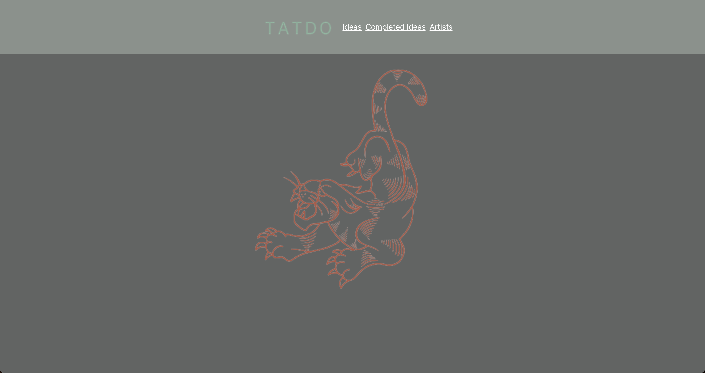

# TatDo


TatDo allows users to keep track of tattoo artists they would like to be tattooed by, along with tattoo ideas. Rather than keeping notes of tattoo ideas in one app, and bookmarking artist profiles in another, TatDo lets users organize all of this in one place. TatDo is for tattoo collectors who need some structure for their enthusiasm. 

## Planning
- [ERD](https://dbdiagram.io/d/6134dcc6825b5b0146f39bb3)

## Setup
1. `git clone git@github.com:cod-y-clark/TatDo.git`
1. `cd` into the created directory
1. `mkdir api`
1. `touch api/database.json`
1.  add `{"users":[], "artists":[], "ideas":[]}` to database.json
1. `json-server -p 8088 -w API/database.json`
1. Type `npm start` to auto host the app.

## Example Data
```json
{
  "users": [
    {
      "id": 1,
      "name": "Cody Clark",
      "email": "cody@cody.com",
      "password": "123"
    }
  "artists": [
    {
      "name": "Chad Koeplinger ",
      "ig_url": "https://www.instagram.com/chadkoeplingertattoo/?hl=en",
      "location": "Nashville, TN",
      "id": 4
    }
  ]
  "ideas": [
    {
      "id": 3,
      "artistId": 3,
      "desc": "Butterfly",
      "body_loc": "Full Stomach",
      "budget": "1500",
      "color": "Color",
      "appt_date": "",
      "completed": false,
      "finalCost": ""
    }
  ]
}
```

## Technologies Used: 
JavaScript
[React](https://reactjs.org/)
CSS
HTML
